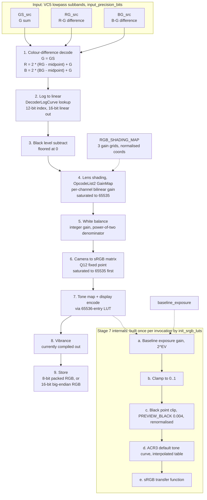

# WaveletToRGB — ISP pipeline

The image signal processing chain in `WaveletToRGB`
(`source/lib/vc5_common/rgb.c`), which turns decoded VC5 wavelet subbands
into display-ready RGB.

It is the SDK's only RGB rendering path, shared by two callers so both
produce identical colour:

| caller | what it renders |
|---|---|
| `gpr_convert_gpr_to_rgb` (decoder) | PPM / JPG output, and every reduced-size raster decode |
| `set_vc5_encoder_parameters` (encoder) | the preview/thumbnail embedded during encoding |

Everything the chain needs arrives in one `RGB_PARAMETERS` struct, so the
two callers cannot drift apart.

## Block diagram

## Stages

| # | stage | domain on exit | driven by | conditional |
|---|---|---|---|---|
| 1 | Colour-difference decode | `input_precision_bits`, signed | `midpoint` from the bit depth | always |
| 2 | Log to linear | 16-bit linear | `DecoderLogCurve` | always |
| 3 | Black level subtract | 16-bit linear | `black_level` | no-op when 0 (GoPro) |
| 4 | **Lens shading (GainMap)** | 16-bit linear | `shading_map` | only when all 3 grids are present |
| 5 | White balance | 16-bit linear | `white_balance_gain` | always |
| 6 | Camera to sRGB matrix | 16-bit linear | `color_matrix` | skipped when identity |
| 7 | Tone map + encode | 8- or 16-bit display | `baseline_exposure`, `bits` | always |
| 8 | Vibrance | 8- or 16-bit display | `PREVIEW_VIBRANCE` | compiled out at 1.0 |
| 9 | Store | output buffer | `bits` | always |

Stages 3 to 6 all operate in the same 16-bit linear domain, which is why
their order is the part that matters most: black level must come off before
any gain, or the pedestal is amplified unequally and tints the image; the
shading gain belongs between black subtract and white balance, which is
where the DNG spec places `OpcodeList2` and where the camera's
`BaselineExposure` assumes it has happened; and the colour matrix has to
follow white balance because its cross-channel terms expect a neutralised
input.

## Notes

**Stage 4 is resolution-independent.** The gain grid is addressed in
normalised image coordinates rather than pixels, so a quarter-size decode
samples the same surface as a full-size one. The grid is reduced from the
source's four CFA GainMap opcodes to three per-channel grids by
`rgb_shading_map_tables` in `source/lib/gpr_sdk/private/gpr.cpp`. Which CFA
cell each opcode describes comes from its own area spec, never its position
in the list, because firmware varies the order.

**Stage 7 is a lookup table, not arithmetic.** `linear16_to_srgb_unit` costs
four `powf` calls and would run three times per pixel, so all 65536 results
are precomputed in about 1 ms. The table depends on the baseline exposure,
so it is rebuilt whenever a decode arrives with a different gain and reused
otherwise.

**Two clipping points are deliberate.** Stage 4 saturates because the gains
reach about 3.9 at the corners and would otherwise wrap the int32
arithmetic that follows. Stage 6 saturates because white-balance gains push
clipped sensor values past 16 bits carrying no information beyond "white",
and feeding those through the matrix's negative terms tints blown
highlights magenta.

**This chain is not a full DNG renderer.** It implements `OpcodeList2`
GainMap only. Geometric correction (`OpcodeList3 WarpRectilinear`) is
metadata that a DNG consumer applies downstream, not something this path
renders, which is why a viewer that needs it hands the written DNG to a full raw
pipeline (Apple ImageIO, Adobe) instead.
